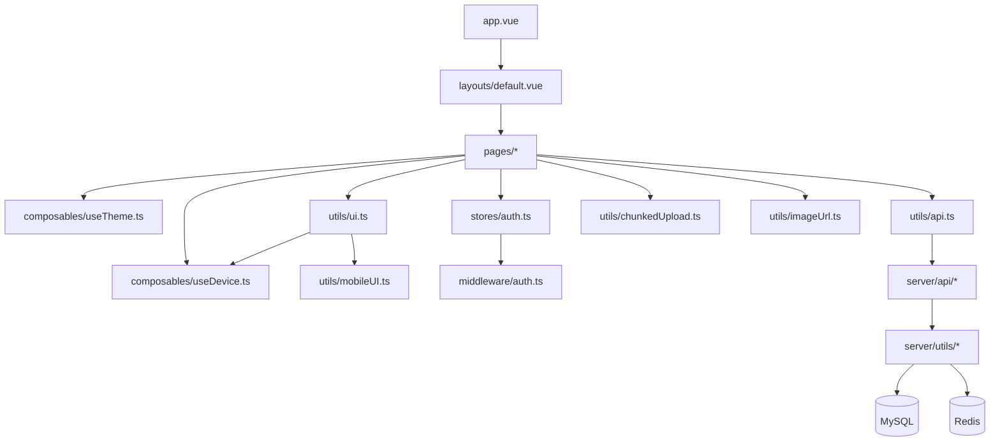

# 整体架构概览

## 架构模式

本项目采用 **Nuxt 3 全栈架构**，前后端代码在同一个 Nuxt 项目中：

- **前端**：Nuxt 3 SSR（Vue 3 + TypeScript + Tailwind CSS）
- **后端**：Nitro Server API（`server/api/`），直连 MySQL + Redis
- **部署**：构建为 `.output/` 产物，PM2 管理进程，Nginx 反向代理

```
┌─────────────────────────────────────────────┐
│                   浏览器                      │
│  ┌─────────┐  ┌─────────┐  ┌─────────────┐  │
│  │ 酷炫首页 │  │ 博客主页 │  │  管理后台    │  │
│  │ Canvas   │  │ SSR+CSR │  │  CSR         │  │
│  └─────────┘  └─────────┘  └─────────────┘  │
└──────────────────┬──────────────────────────┘
                   │ HTTP
┌──────────────────▼──────────────────────────┐
│              Nuxt 3 / Nitro                  │
│  ┌─────────────────────────────────────────┐ │
│  │          SSR 渲染引擎                    │ │
│  │   useAsyncData → 服务端预取数据          │ │
│  └─────────────────────────────────────────┘ │
│  ┌─────────────────────────────────────────┐ │
│  │       Server API（/api/*）               │ │
│  │   auth / articles / albums / messages    │ │
│  │   photos / profile / upload / changelog  │ │
│  └──────────┬───────────────┬──────────────┘ │
└─────────────┼───────────────┼────────────────┘
              │               │
     ┌────────▼──────┐  ┌────▼────┐
     │   MySQL 8.0   │  │  Redis  │
     │  8 张业务表    │  │  主题/  │
     │               │  │  Token  │
     └───────────────┘  └─────────┘
```

## SSR 策略

| 页面 | 渲染模式 | 说明 |
|------|---------|------|
| `/`（酷炫首页） | CSR | 纯 Canvas 交互，无 SEO 需求 |
| `/home`（博客主页） | SSR + CSR | 首屏数据（文章/资料/日志）服务端预取，相册等懒加载 |
| `/articles/:id`（文章详情） | SSR | 文章内容服务端预取，利于 SEO |
| `/login`（登录） | CSR | 无 SEO 需求 |
| `/admin`（管理后台） | CSR | 鉴权保护，无 SEO 需求 |

### SSR 关键实现

1. **useAsyncData 预取**：`home.vue` 中 `fetchArticles()`、`fetchProfile()`、`fetchChangelog()` 使用 `useAsyncData` 在服务端预取
2. **Pinia Hydration 修复**：`pinia-hydration-fix.ts` 插件在 `app:rendered` 钩子中用 `JSON.parse(JSON.stringify())` 清洗 payload，解决 mysql2 RowDataPacket 无 `hasOwnProperty` 的问题
3. **ClientOnly 包裹虚拟滚动**：`vue-virtual-scroller` 的 `DynamicScroller` 不支持 SSR，用 `<ClientOnly>` 包裹，文章列表 fallback 为静态 `v-for`

## 主题系统

```
┌─────────────┐     ┌─────────────┐     ┌─────────────┐
│  Cookie      │────▶│  useState    │────▶│  HTML class  │
│ color-mode   │     │ color-mode   │     │   "dark"     │
└──────┬──────┘     └─────────────┘     └─────────────┘
       │                                        │
       │ 切换时异步存储                           │ Tailwind dark: 前缀
       ▼                                        ▼
┌─────────────┐                         ┌─────────────┐
│   Redis      │                         │  UI 渲染     │
│ theme:xxx    │                         │  Dark/Light  │
└─────────────┘                         └─────────────┘
```

- **SSR 零闪烁**：`app.vue` 中通过 `useHead` 将 `computed(() => colorMode.value === 'dark' ? 'dark' : '')` 注入 `<html class>`
- **持久化**：Cookie（30 天 maxAge）+ Redis 异步存储
- **默认值**：首次访问默认 `dark` 模式
- **Tailwind 配置**：`darkMode: 'class'`

## 鉴权系统

```
┌──────────┐   POST /api/auth/login   ┌──────────────┐
│  登录页   │ ─────────────────────▶  │  生成 Token   │
│ login.vue │                          │  写入 MySQL   │
└──────────┘                          │  设置 Cookie   │
                                      └──────────────┘

┌──────────┐   middleware/auth.ts     ┌──────────────┐
│  访问     │ ─────────────────────▶  │  1. 内存态？放行│
│  /admin   │                          │  2. 有Cookie？  │
└──────────┘                          │  3. checkAuth() │
                                      │  4. SSR转发Cookie│
                                      └──────────────┘
```

- **Token 存储**：MySQL `auth_tokens` 表，重启/部署不丢失
- **TTL 策略**：72 小时滚动续期（每次 check 更新 `lastActiveAt`）
- **Cookie**：`auth_token`，httpOnly，secure
- **SSR Cookie 转发**：`stores/auth.ts` 中 `checkAuth()` 使用 `useRequestHeaders(['cookie'])` 在 SSR 阶段转发浏览器 Cookie

## 图片上传架构

```
文件 ≤ 1.5MB ──▶ POST /api/upload ──▶ sharp 压缩 ──▶ /uploads/xxx
                                                      │
文件 > 1.5MB ──▶ 分片上传                              ▼
                 ├─ POST /api/upload/chunk (逐片)    CDN: cdn.fatwill.cloud/uploads/xxx
                 ├─ POST /api/upload/merge (合并)
                 └─ DELETE /api/upload/chunk (失败清理)
```

- 前端工具：`utils/chunkedUpload.ts`
- 分片大小：1.5MB
- 进度回调：`onProgress({ loaded, total, percent })`
- CDN 转换：`utils/imageUrl.ts` 的 `toCdnUrl()` 在前端渲染时转换

## 跨端 UI 适配

| 场景 | PC 端 | 移动端 |
|------|-------|--------|
| Loading | `ant-design-vue` Spin | 自定义 SVG spinner |
| Toast | `message.success/error/info` | `MobileToast.success/error/show` |
| 确认弹窗 | `Modal.confirm` | `MobileDialog.confirm` |
| 布局 | 右上角固定按钮组 | 左上角汉堡菜单 + 侧滑抽屉 |

统一封装在 `utils/ui.ts`，调用方无需关心端类型：

```typescript
showSuccess('操作成功')  // 自动选择 antd message 或 MobileToast
showConfirm({ title: '确认删除？', onOk: handleDelete })
```

## 模块依赖关系



## 待重构方向

当前项目所有业务逻辑内聚在页面级 `.vue` 单文件组件中（`home.vue` 82KB、`admin.vue` 57KB），后续可考虑：

1. **Feature-First 模块化**：将文章、相册、留言板等拆分为独立 feature 模块
2. **组件拆分**：将大页面拆分为子组件，每个组件 < 500 行
3. **Service 层抽离**：将 `utils/api.ts` 按领域拆分为 `articleService.ts`、`albumService.ts` 等
4. **Composable 抽离**：将页面内的复杂逻辑提取为 composable（如 `useArticleList`、`useAlbumGallery`）
